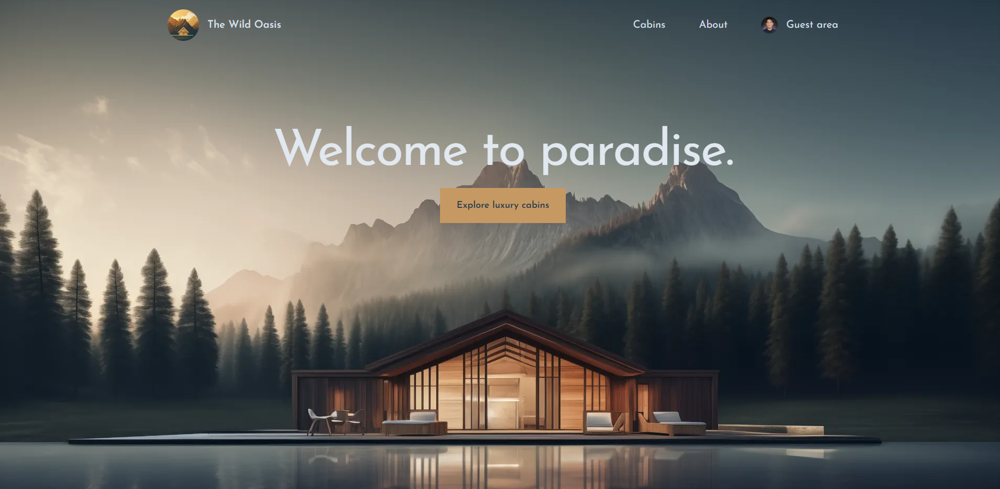

# Next.js The Wild Oasis App

A Full Stack Wild Oasis app (User POV) built with Next.js.

# Highlights

- Built from a ready-made UI (desktop view), creating a full-stack reservation system for luxury cabins with details, about, and guest areas.
- Added a mobile version for better accessibility, responsiveness, and interactive UI.
- Integrated a database to store cabin data and implemented CRUD features with validation.
- Added user authentication with Google Sign-Up for easy access.
- Included a guest area for viewing reservations and updating the guest profile.

# Technologies

- Vite
- JavaScript
- Tailwind
- Next.js
- NextAuth.js
- Node.js
- Supabase

# View Live Demo

https://gce-nextjs-the-wild-oasis.vercel.app/
